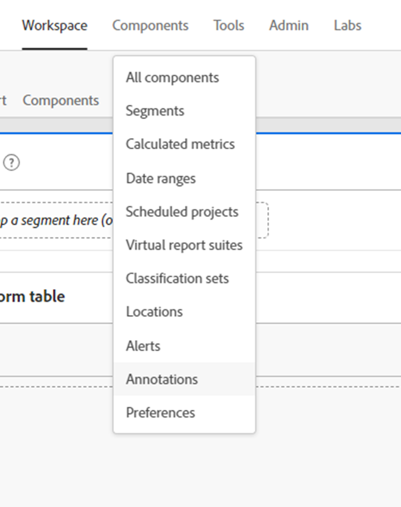

# Het analytisch inzicht ontgrendelen; de kracht van annotaties benutten

De gegevenscomponent Annotations is een van de eenvoudigste, maar op lange termijn toch een van de meest tijdbesparende functies die in Adobe Analysis Workspace worden aangeboden. In tegenstelling tot andere functies in Workspace fungeert het als een historisch historisch geheugen voor u en uw collega Workspace-gebruikers.

Eenvoudig gezegd, Annotaties zijn korte beschrijvingsteksten die kunnen worden toegevoegd aan datumgebonden gegevens in de werkruimte van de Adobe. Annotaties bieden context aan iedereen die Analysis Workspace gebruikt om de gegevensgeschiedenis van uw bedrijf te begrijpen, helpen sneller prestaties te analyseren en geven al uw rapporten een zeer aangepast gevoel.

## Gebruiksscenario’s

Er zijn meerdere situaties waarin Annotaties bijzonder handig zijn:

- **Uitstekers (pieken en troggen)** - als u de reden voor de grote pieken en de grote ruiten van trended gegevens kent, klik snel op het outlier gegevenspunt met de rechtermuisknop en kies &quot;de selectie van de Annoteren&quot;om die kennis met iedereen te delen.

- **Belangrijke marketingcampagnes en -tests** - als marketingcampagnes en tests (A/B, multivariatie, enz.) kan direct invloed hebben op verkeer en prestaties. Het is voor iedereen eenvoudig om het tijdsbestek van deze campagnes en tests in Annotaties te documenteren.

- **Externe factoren en gebeurtenissen** - alles, van grote eenmalige gebeurtenissen tot acties van concurrenten, nieuwe productreleases en relevante wereldwijde of binnenlandse gebeurtenissen, moet zeker zijn dat alle relevante externe factoren aan annotaties worden toegevoegd.

- **Tussenruimten en fouten** - u moet de functie Waarschuwingen gebruiken om u te waarschuwen voor mogelijke problemen bij het verzamelen van gegevens, maar zelfs het meest gekruiste team ervaart helaas een of andere vorm van fouten bij het verzamelen van gegevens of tijdelijke lacunes van tijd tot tijd. Annotaties zijn een goede manier om de impact te minimaliseren door gebruikers te laten weten dat gegevens ontbreken of onvolledig zijn.

## Instructies

Het maken en bewerken van annotaties is intuïtief en vrijwel vanzelfsprekend. Klik met de rechtermuisknop op een gegevenspunt in een getrineerde visualisatie- of vrije-vormtabel en kies Selectie notities aanbrengen om een annotatie te maken of gebruik de hoofdnavigatie naar &quot;Componenten > Annotaties&quot; om annotaties te maken en te bewerken.

{width="70%"}{width="30%"}

Voor alle details over hoe Annotaties werken, moet u de optie [videozelfstudie over Experience League](https://experienceleague.adobe.com/en/docs/analytics-learn/tutorials/analysis-workspace/navigating-workspace-projects/annotations-in-analysis-workspace).

## Tips en trucs om aan de slag te gaan

Tot slot zijn er enkele handige tips om u meteen met annotaties te laten beginnen.  Met deze suggesties kunt u uw annotaties effectief, duidelijk en informatief maken voor alle gebruikers.

- **Kleurcodering** - Met de functie Annotaties kunt u kiezen uit een kleurenbereik dat in uw werkruimteprojecten wordt weergegeven om u te helpen onderscheid te maken tussen verschillende typen annotaties. Als u meerdere verschillende sites of apps meet, kunt u voor elke site een andere kleur kiezen. Of misschien een andere kleur voor elke categorie van annotaties.

- **Titel Etikettering** - Een extra manier om gebruikers gemakkelijk visuele aanwijzingen voor een annotatie te geven, is het labelen van de titel van de annotatie. Net als bij kleurcodering kunt u verschillende labels kiezen op basis van de structuur van uw organisatie, bijvoorbeeld op kanaal of naam (WEB, APP of ALL).

- **Toepassingsgebied** - Wanneer u een annotatie maakt, hebt u de beschikking over het volledige scala aan dimensies, maateenheden en limiters om annotaties in de juiste context weer te geven. Sommige annotaties zijn alleen relevant voor bepaalde afmetingen of metriek, dus u kunt beperken wanneer een annotatie wordt weergegeven voor de corresponderende dimensie of metrische waarde.

- **Opslaan als** - Als u een of twee annotaties hebt gemaakt, kunt u deze opnieuw gebruiken als sjablonen om nieuwe annotaties te maken met de optie Opslaan als.

- **Annotatiebeheer** - Gebruik de hoofdnavigatie naar &quot;Componenten > Annotaties&quot; om Annotatiebeheer te bereiken. Hier vindt u uitgebreidere functionaliteit voor het maken en bewerken van annotaties.

- **Machtigingen -** Als u niet de capaciteit hebt om Annotaties tot stand te brengen, bereik aan uw beheerder die &quot;Aantekening tot&quot;in de Admin Console kan toestaan.

Voor gedetailleerde documentatie gaat u naar [Overzicht van annotaties](https://experienceleague.adobe.com/en/docs/analytics/analyze/analysis-workspace/components/annotations/overview) en omringende artikelen.

## Auteur

Dit document is geschreven door:

Thomas Edward Buckley, Data Warehouse en Business Intelligence van Miles &amp; Meer (Lufthansa-groep)
