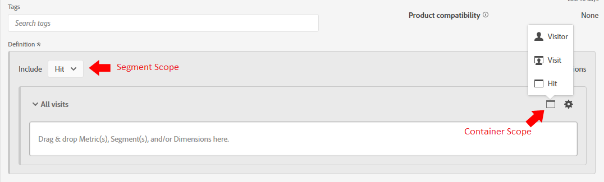
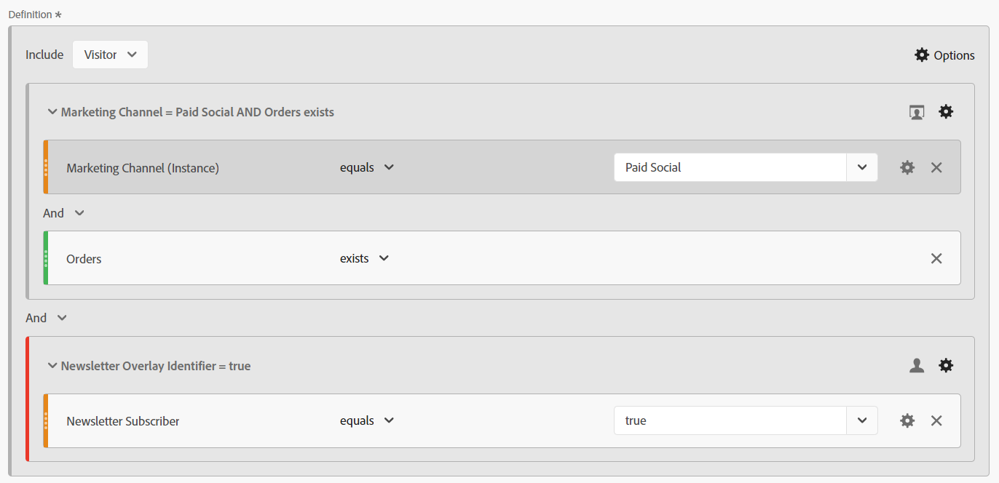

# De magie achter het gordijn: complexe segmenten: uitsluiten, containers en attributie

_Ontdek de complexiteit van complexe gegevenssegmentatie, waarbij wordt gezocht naar uitsluitingen, containers en attributiemodellen. Net als een handje van een goochelaar, stelt het beheersen van deze technieken analisten in staat om gegevensmagie uit te voeren en inzichten met precisie en vinding te transformeren._

De gordijnen zijn open, het podium is ingesteld... dit is misschien geen magische handeling van Las Vegas, maar we kunnen een aantal verbazingwekkende trucs uitvoeren bij het bouwen van onze segmenten.

Binnen deze module zullen wij behandelen:

- Logica uitsluiten
- Containers gebruiken
- Attributiemodel

## Inclusief of uitsluiten

Standaard beginnen alle containers als **include** type, wat betekent dat ze de gegevens retourneren die aan de criteria voldoen. U kunt echter ook het segment of de containers in de te maken segmenten wijzigen **uitsluiten** type, zodat u bepaalde criteria kunt afwijzen.

Hoewel een goochelaar je kaart in het dek kan vinden, is het verbazingwekkend wanneer die goochelaar de rest van het dek niet kan laten bestaan. Op dezelfde manier in sluit segmenten uit, willen wij de ongewenste gegevens eenvoudig van onze gegevensreeks verdwijnen.

Misschien zit je daar te denken: &quot;Oké, maar ik heb al opties &quot;Is niet gelijk&quot; en &quot;Bevat niet&quot;, dus moet dat me niet bedekken?&quot; Jammer genoeg, is het antwoord daarop neen... en het gaat niet alleen over het kunnen groepen van logica uitsluiten, over één enkel element. Zelfs wanneer u met één component werkt, zult u vaak moeten gebruiken *uitsluiten* om uw doel te bereiken.

- **Bevat niet / Is niet gelijk** - Is precies wat het klinkt, aanpassing op punten die geen specifiek koord bevatten
- **Exclusief: waarde bevat / is gelijk** - Dit zal *uitsluiten* items die overeenkomen met de tekenreeks

Op het eerste gezicht klinkt dit allebei hetzelfde... en op **hit** niveausegmenten/containers, zou u correct zijn, aangezien zij de zelfde actie zullen uitvoeren. Bij gebruik van **bezoek** of **bezoeker** het bereik dat u krijgt zal sterk verschillen .

**Afbeelding 1: Bevat niet/is niet gelijk aan - Actief bereik**

*Merk op dat elke treffer een waar of vals waarde terugkeert, en dat die waarden tussen worden omgekeerd doet niet en sluit uit.*

- Bevat &quot;Waarde&quot; niet &quot;Voorbeeld&quot; (Ja), retourneert daarom true en neemt die hit op. Bevat &quot;Voorbeeld&quot; evenmin &quot;Voorbeeld&quot; (geen voorbeeld), retourneert daarom false en neemt die hit niet op. Retourneer in principe alle gegevens die een waar resultaat opleveren.
- Bevat &quot;Waarde&quot; &quot;Voorbeeld&quot; (nee), retourneert daarom false en sluit die hit niet uit. Bevat &quot;Voorbeeld&quot; ook &quot;Voorbeeld&quot; (yes), retourneert daarom true en sluit die hit uit. Retourgegevens die wel **niet** hebben een echt resultaat, of retourgegevens die volgens uw criteria onwaar zijn.
- U kunt dat zien op het **Actief** niveau, beide reeksen logica zullen de zelfde reeks gegevens terugkeren.

**Afbeelding 2: Bevat niet/is niet gelijk aan - Bezoek het bereik**

*Zoals hierboven, elke hit in de **bezoek**worden met dezelfde waarde voor waar en onwaar geëvalueerd. De gegevensset die wordt geretourneerd, is echter die van het hele bezoek.*

- Op elke hit bevat &quot;Value&quot; geen &quot;Example&quot; (yes), dus retourneert &quot;Example&quot; geen &quot;Example&quot; (no, it contains it it), zodat false wordt geretourneerd.
   - Indien **alle** hit in the visit returns **true** en vervolgens de **volledig bezoek** wordt geretourneerd.*
   - Als het bezoek volledig uit klappen bestond die &quot;Voorbeeld&quot;bevatten, dan zouden geen klappen waar terugkeren en daarom zou dat bezoek **niet worden geretourneerd** in uw gegevensset.
- Op elke hit bevat &quot;Example&quot; (yes) dus &quot;true&quot;
   - Indien **elke treffer** retourneert **true**, zal het hele bezoek **uitgesloten**
   - Indien **alle treffers** in de terugkeer van het bezoek **false**, dan wordt dat bezoek geretourneerd in uw gegevensset
- Nu kun je zien waar deze logica begint af te wijken. In het bovenstaande voorbeeld zijn er drie verschillende bezoeken:
   - Bij gebruik van &quot;Bevat niet/Gelijk&quot; **twee van de drie** de bezoeken zullen worden teruggezonden .
   - Bij gebruik van &quot;Bevat/Gelijk niet opnemen&quot; **slechts één** van deze bezoeken zullen worden teruggezonden

**Afbeelding 3: Bevat niet/is niet gelijk aan - Bezoek het bereik**

*Zoals hierboven, elke treffer gemaakt door de **bezoeker**worden geëvalueerd met dezelfde logica voor waar en onwaar. Maar nu kijken we naar alle treffers die deze bezoeker heeft gemaakt voor alle bezoeken (binnen het geselecteerde datumbereik).*

- Op elke hit bevat &quot;Value&quot; geen &quot;Example&quot; (yes), dus retourneert &quot;Example&quot; geen &quot;Example&quot; (no, it contains it it), zodat false wordt geretourneerd.
   - Indien **alle** getroffen door bezoekersaantallen **true** en vervolgens de **volledig bezoek** wordt geretourneerd.
   - Als de bezoeker nooit een hit met &quot;Voorbeeld&quot; heeft gemaakt, zouden er geen treffers worden geretourneerd, zodat die bezoeker **niet worden geretourneerd** in uw gegevensset.
- Op elke hit bevat &quot;Example&quot; (yes) dus &quot;true&quot;.
   - Indien **elke treffer** retourneert **true** de gehele bezoeker (en vervolgens al zijn bezoeken) **uitgesloten.**
   - Indien **alle treffers** in de terugkeer van het bezoek **false**, wordt die bezoeker geretourneerd in uw gegevensset, waardoor bezoekers die &quot;X&quot; niet hebben gedaan, worden geretourneerd.
- Dit is een uitbreiding van de logica van het bezoek, waar nog meer overwegingen zijn. In het bovenstaande voorbeeld zijn er twee verschillende bezoekers, met elk drie bezoeken:
   - Bij gebruik van &quot;Bevat niet/Gelijk&quot; **beide** bezoekers worden teruggestuurd , net als alle **drie** van hun bezoeken (2 bezoekers en 6 bezoekers in uw rapporten)
   - Bij gebruik van &quot;Bevat/Gelijk niet opnemen&quot; **slechts één** van deze bezoekers worden teruggestuurd en alleen de drie bezoeken die met die bezoeker verband houden worden opgenomen (1 bezoeker en 3 totale bezoeken in uw rapporten)

>[!TIP]
>
>Deze logica kan complex zijn, vooral wanneer u begint containers te nesten... het is altijd een goed idee om tegen gecontroleerde steekproefgegevens te testen om ervoor te zorgen dat uw segment in feite de gegevens terugkeert u denkt het zou moeten.

### Segmentvoorbeeld 1: bezoeken uitsluiten die een aankoop doen

In dit voorbeeld wil ik gebruikers aanwijzen die naar een site zijn gekomen en *niet* een aankoop doen tijdens hun bezoek (in feite wil ik de bezoeken uitsluiten die een transactie hebben uitgevoerd; daarom zal ik worden verlaten met de bezoeken die een transactie niet hebben voltooid)

Ter vergelijking, kijk naar een segment dat wordt gebouwd gebruikend &quot;niet bestaat&quot;:

In de voorvertoning ziet u een heel ander resultaat... In feite retourneert dit segment 100% van mijn bezoeken, omdat elk bezoek ten minste één hit heeft die de &quot;Order&quot;-meting niet bevat.

Om dit verder te illustreren, laten wij de twee segmenten naast elkaar vergelijken:

In de eerste plaats kun je zien dat ondanks de *bezoek* niveauwerkingsgebied van het segment, kunnen wij het segment met andere metriek (zoals paginameningen of unieke bezoekers) koppelen. De eerste reeks kolommen is ongesegmenteerd, om in één oogopslag te laten zien dat het ene segment (niet bestaat) bijna 100% van de gegevens retourneert, doet alleen het exclude-segment wat we nodig hebben.

De meest opvallende kolom is de orden, die onmiddellijk duidelijk zouden moeten zijn dat de container &quot;niet bestaat&quot;verkeerd is, aangezien de meeste orden nog worden teruggegeven.

### Segmentvoorbeeld 2: bezoekers uitsluiten die een aankoop hebben gedaan binnen de rapportageperiode

In dit voorbeeld, wil ik de ideeën van de vorige steekproef gebruiken (die specifiek het bezoekniveau) keek en het uitbreiden om de bezoekers te vinden die geen aankoop binnen het tijdskader van mijn rapport hebben gemaakt.

Dit segment zal er ongeveer hetzelfde uitzien als het bovenstaande voorbeeld, bijna identiek, maar de reikwijdte van het segment zal een groot verschil maken.

Als we het bereik van de bezoeker vergelijken met het hierboven beschreven segment van het bezoek, zien we dat veel meer gegevens en veel meer bezoeken zijn uitgesloten, omdat *bezoekers die aankopen hebben gedaan* er werden ook bezoeken afgelegd waar geen aankopen werden gedaan , zodat deze bezoeken ook buiten beschouwing worden gelaten omdat zij deel uitmaken van de levenscyclus van de bezoeker .

>[!IMPORTANT]
>
>Wanneer u een bezoeker scoped gegevens kijkt, langer uw rapporttijdkader, groter de uitsluiting zal zijn, aangezien vele bezoekers loyaal bezoekers aan uw plaats terugkeren (natuurlijk zullen sommige bedrijfsmodellen een hogere impact zien dan anderen)

>[!IMPORTANT]
>
>De verschillen tussen bezoek en bezoeker kunnen *subtiel* (met name in deze voorbeeldgegevens) zijn deze unieke logica die in overweging moet worden genomen. Afhankelijk van uw site en gebruikersgedrag kunnen uw gegevens opvallend verschillend zijn.

Het is belangrijk om precies te weten welke gegevens, of wat *verhaal*, probeert u het met uw rapport te zeggen. Zorg ervoor dat uw tabellen en visualisaties het publiek duidelijk vertellen ***wat*** wordt getoond, en het gebruiken van het aangewezen segmentmodel is essentieel om aangewezen analyse te maken. Een geïnformeerde beslissing kan alleen goed worden genomen als iedereen begrijpt waar hij naar kijkt.

## Containers gebruiken

Containers bieden ons de mogelijkheid om &quot;sub-logic&quot; te maken binnen de hoofdlogica van het segment, en een algemene misvatting is dat het bereik allemaal hetzelfde moet zijn tussen het segment en de container.. maar dat doet het niet. Dit geeft ons meer vrijheid om specifieke scenario&#39;s te creëren in het grotere geheel van dingen, om complexe logica te bouwen.

De beste manier om over containers na te denken is elke container een doos te zijn, en dat we dozen (van logica) binnen een andere doos, binnen een andere doos kunnen stapelen... maar in tegenstelling tot fysieke dozen waar elke doos kleiner moet zijn dan de buitendoos, kunnen we iets groter binnen zetten als dat ons ertoe aanzet om de juiste gegevens terug te krijgen. Beschouw het als een goochelhoed, waar het onmogelijke erin past en we de goochelaars van data zijn...

### Reikwijdte van de containers

Laten we eerst een snelle uitsplitsing maken van *container* bereik. leuk *segment s* het gaat om je basisvermogen **hit**, **bezoek** en **bezoeker** bereikopties, maar soms zult u ook iets zien genoemd **logische groep** in plaats van bezoeker (dit zal slechts binnen opeenvolgende segmenten voorkomen, en wij zullen die in het volgende artikel behandelen).

Het toevoegen van containers binnen uw segment (of binnen andere containers) kan worden bereikt door tot **opties*** menu (wanneer het nesten van veelvoudige punten, ben zorgvuldig om aan het correcte blok toe te voegen - hoewel u gelukkig containers binnen de interface kunt slepen en laten vallen als u het aan de verkeerde plaats toevoegt)

**Afbeelding 1: Een container toevoegen**

Het bereik van een container is onafhankelijk van de moedermaatschappij, zoals ik al zei, deze *niet* moet overeenkomen. Afhankelijk van wat u wilt retourneren, moet u mogelijk het plan uittekenen om volledig te visualiseren wat u nodig hebt, tenminste totdat u het in uw hoofd comfortabel kunt visualiseren.

**Afbeelding 2: Segmentbereik versus containerbereik**

>[!NOTE]
>
>Adobe heeft logica om geldige en ongeldige segmenten te begrijpen. Ze bieden u geen opties die *nooit* werk... dus als u de optie ziet om een bezoeker scoped container binnen een hit scoped segment te gebruiken, betekent dit dat het een geldige optie is.

Net als voor basissegmenten, wanneer u een complex segment met geneste containers gaat bouwen, moet u een duidelijk idee hebben over ***wat*** soort gegevens die u wilt retourneren. ***Hoe*** bent u van plan om die gegevens te gebruiken ? ***Welke*** metriek bent u van plan op het samenbrengen met het segment?

Deze vragen zullen helpen bepalen wat het werkingsgebied van het segment als geheel zal zijn, is dit het uitgangspunt aan om het even welk segment.

Enkel omdat u van plan bent om een segment met uw unieke bezoekers te koppelen, betekent niet dat het segment zelf bezoekersniveau... ver van het zou moeten zijn. Een bezoekersniveausegment retourneert alle gegevens voor een bezoeker... dit betekent al hun bezoeken, al hun paginaweergaven enz.. Zodra een bezoeker aan uw segmentcriteria voldoet, kan uw segment gegevens uit het segment retourneren *verleden* voor deze bezoeker (zolang deze zich binnen het datumbereik van uw werkruimte bevindt).

>[!IMPORTANT]
>
>Zelfs wanneer het van plan zijn om een segment met unieke bezoekers metrisch te koppelen, dit *betekent niet* dat het segment automatisch bezoekersbereik moet zijn... Deze misvatting *misschien* opgeblazen en onjuiste resultaten opleveren.

Ik heb veel gesproken over de concepten van hoe je het juiste bereik kunt selecteren, maar geen voorbeelden of details die je echt helpen... dus laten we daar nu in duiken met een paar voorbeelden van echte bruikbare gevallen. Ze zeggen dat een goochelaar nooit hun geheimen onthult, maar dat is niet helemaal waar. Binnen de magische wereld worden de technieken en &quot;achter het gordijn&quot;-werkingen vaak met gelijken gedeeld, zodat ze kunnen voortbouwen op de illusie en deze kunnen verbeteren... en dat is wat ik wil doen... om de deur open te zetten voor de mogelijkheden die je wachten.

### Segmentvoorbeeld 3: weergaven op specifieke pagina&#39;s van bezoekers die een recente bestelling hebben uitgevoerd (binnen de rapportageperiode)

In dit scenario, wil ik slechts een reeks specifieke pagina&#39;s terugkeren die door recente kopers werden geraakt (merk op dat ik dit met bezoeken of unieke bezoekers kan nog koppelen, alhoewel het segment zelf bij een werkingsgebied van HIT zal zijn).

Dit soort scenario is goed om te bekijken als ik kopers heb die specifieke pagina&#39;s op een plaats bekijken, pagina&#39;s die niet uitdrukkelijk met een specifieke gebeurtenis kunnen worden verbonden.

Mijn voorbeeld gaat de pagina&#39;s van &quot;Aanbevolen Overeenkomsten&quot;en &quot;Aanbevolen Producten bekijken&quot;. Momenteel, zullen wij de logica eenvoudig houden en niet in opeenvolgende segmentatie (minstens nog niet, maar wij zullen complexere logica als dat in een toekomstig artikel behandelen).

Een andere vraag is: **waarom** trekken we terug door klappen ? Technisch gezien zou ik hier bezoekers of bezoekers kunnen volgen, maar ik wil misschien ook naar deze specifieke pagina&#39;s kijken door **paginaweergaven (voor de specifieke paginaset) per bezoek** of **paginaweergaven (voor de specifieke set) per bezoeker** Dit bereik geeft me de flexibiliteit om deze specifieke wiskunde uit te voeren. Aangezien deze treffers gemakkelijk met bezoeken of unieke bezoekers kunnen worden gecombineerd om het aantal bezoeken of bezoekers te bepalen die deze pagina&#39;s zien, zal ik voor het meest flexibele segment kiezen dat ik voor alle scenario&#39;s kan gebruiken.

Ten eerste, ter vergelijking, hier is een eenvoudig op HIT-Gebaseerd segment voor de specifieke pagina&#39;s.

Nu, bouwen in de ingewikkeldheid:

U zult merken dat ik niet alleen meerdere containers gebruik, maar dat ik het bereik van deze containers vermeng. Het segment als geheel bevindt zich op HIT-niveau, maar ik ben ook op zoek naar bezoekers die een bestelling hebben gedaan.

Laten we wat tijd besteden om dit uit te pakken, want er is veel gaande.

In de eerste plaats laat ik in plaats van een dagelijkse ineenstorting een paginascheiding zien, omdat ik denk dat dit de twee segmenten beter zal illustreren.

 De eerste drie kolommen (Paginaweergaven, bezoeken en unieke bezoekers) zijn ongesegmenteerd en geven dus alle pagina&#39;s in de site weer. Ik heb hier geen bestellingen opgenomen, omdat bestellingen worden bijgehouden in een handeling en dus geen deel uitmaken van het bereik van de pagina-dimensie.

 Vervolgens laat ik het resultaat van het eenvoudige segment zien, waarbij ik alleen naar **treffers** op de twee opgegeven pagina&#39;s. U zult merken dat de andere pagina&#39;s in de uitsplitsing allemaal 0 opleveren, zoals u verwacht.

 Hier is een klein bonusuiteinde, voordat ik het resultaat van het geavanceerde segment laat zien, gebruikte ik nog een eenvoudig segment van &quot;Orders bestaan&quot; (op HIT-niveau), en ik koppelde het aan unieke bezoekers. Dit zal me de totale UVs terugkeren die orden in mijn verslagperiode maakten, evenals UVs die elk van die pagina&#39;s raken.. dit zal helpen om de volgende reeks kolommen beter te illustreren.

 De laatste reeks kolommen wordt gestapeld met mijn complexe segment. De algemene UV&#39;s met bestellingen komen overeen met het eenvoudige segment &quot;Bestellingen bestaan&quot; op elke pagina, maar u zult zien dat het totaal aanzienlijk verschilt. Aangezien deze gegevensset expliciet alleen beperkt is tot bezoekers die bestellingen hebben geplaatst EN de pagina&#39;s raken, ben ik expliciet geïnteresseerd in deze set.

### Segmentvoorbeeld 4: bezoeken die aanbevolen deals OF producten betreffen EN een bestelling maken tijdens hetzelfde bezoek

In het bovenstaande voorbeeld ziet u hoe u een container met een groter bereik (bezoeker) binnen een kleinere container met bereik kunt toevoegen (druk dus op zodat het geen verrassing is dat u raakcontainers binnen bezoekers kunt toevoegen of bereiksegmenten kunt bezoeken).

Op sommige van dezelfde pagina&#39;s waar we eerder naar keken, willen we nu gewoon de bezoekers terugkrijgen die de aanbevolen deals of de aanbevolen productpagina raakten EN die tijdens hetzelfde bezoek een bestelling maakten.

Dit segment mengt alle drie het werkingsgebied. Het hoogste niveau van het segment is bezoeker, zodat zal dit ervoor zorgen dat ALLE klappen van alle bezoeken voor de passende bezoeker worden teruggekeerd. Daarbinnen hebben wij een container toegevoegd van het bezoekbereik, dat zal ervoor zorgen dat de bezoeker minstens één bezoek moet hebben gehad dat aan de specifieke criteria van het maken van een orde voldoet EN specifieke pagina&#39;s heeft bezocht. We hebben een container van het bereik van hit toegevoegd voor de pagina&#39;s zelf, zodat we OR-logica kunnen gebruiken om te zoeken naar de pagina met aanbevolen deals OF de pagina met aanbevolen producten.

Het voordeel voor dit bereiksegment van de bezoeker is dat dit zal terugkeren **ALLES** bezoeken van de bezoekers die aan deze criteria voldoen, zodat dit segment goed zal zijn als ik het gedrag wil zien van eerdere bezoeken die tot deze combinatie leiden, en de acties van deze bezoekers na een dergelijk scenario.

Hier vergelijkt ik hits op aanbevolen deals/aanbevolen inhoud met bestellingen die al bestaan, met het complexe segment waarin zowel de bestelling als een van de opgegeven pagina&#39;s zich tijdens hetzelfde bezoek bevinden. Het complexe segment is waar de twee eerste segmenten elkaar kruisen; maar aangezien het bezoekerswerkingsgebied is, zullen alle andere bezoeken voor die bezoekers eveneens worden teruggekeerd.

## Attributiemodel

Attributiemodellen binnen een segmentdefinitie hebben meestal betrekking op dimensies die een niet-klapbare vervaldatum hebben, dus props (die altijd raakniveau zijn) zijn niet echt een goede kandidaat. Uw eVars, marketingkanalen, enz. maar zijn eigenlijk waar deze instellingen voor bedoeld zijn .

Voordat we naar het segment kijken, moeten we snel bekijken hoe attributiemodellering in een eenvoudig voorbeeld werkt.

Laten we zeggen dat we twee eVars hebben, waarvan er één op het punt staat te vertrekken (eVar1), en één op 30 dagen vervalt (eVar2). Om het eenvoudig te houden, gaan we een interne campagne (icid) volgen.

**Bezoek 1**

- Pagina A
   - **eVar1** is niet ingesteld
   - **eVar2** is niet ingesteld
- Klik op Promo Banner met ?icid=promo-banner in de URL
- Pagina B
   - **eVar1** en **eVar2** zijn ingesteld op &quot;promo-banner&quot;
   - **Instance van eVar1** wordt geactiveerd
   - **Instance van eVar2** wordt geactiveerd
- Pagina C
   - Beide **eVar1** en **eVar2** de waarde &quot;promo-banner&quot; behouden
   - Geen van de maatgegevens van de instantie voor de eVars wordt geactiveerd, omdat beide Vars persistente waarden gebruiken

**Bezoek 2**

- Pagina D
   - **eVar1** is niet ingesteld op een waarde en is niet ingesteld op **Instance van eVar1** wordt geactiveerd
   - **eVar2** handhaaft de &quot;promo-banner&quot;waarde wegens 30 dagvervaldag
   - **Instance van eVar2** wordt niet geactiveerd, omdat de waarde blijvend is en niet daadwerkelijk is ingesteld
- Klik op Aanbieding zijspoor met ?icid=promo-side-rail in de URL
- Pagina E
   - **eVar1** en **eVar2** zijn ingesteld op &quot;promo-side-rail&quot;
   - **Instance van eVar1** wordt geactiveerd
   - **Instance van eVar2** wordt geactiveerd
- Pagina F
   - Beide **eVar1** en **eVar2** de waarde &quot;promo-side-rail&quot; behouden
   - Geen van de maatgegevens van de instantie voor de eVars wordt geactiveerd, omdat beide Vars persistente waarden gebruiken

Momenteel is het verwachte resultaat van deze twee bezoeken:

<table><tr><th colspan="1" valign="top"></th><th colspan="1" valign="top"></th><th colspan="1" valign="top"><b>Paginaweergaven</b></th><th colspan="1" valign="top"><b>Bezoeken</b></th><th colspan="1" valign="top"><b>Instance van eVar1</b></th><th colspan="1" valign="top"><b>Instance van eVar2</b></th></tr>
<tr><td colspan="1" valign="top"></td><td colspan="1" valign="top"></td><td colspan="1" valign="top">6</td><td colspan="1" valign="top">2</td><td colspan="1" valign="top">2</td><td colspan="1" valign="top">2</td></tr>
<tr><td colspan="1" rowspan="7" valign="top">Pagina</td><td colspan="1" valign="top"></td><td colspan="1" valign="top">6</td><td colspan="1" valign="top">2</td><td colspan="1" valign="top">2</td><td colspan="1" valign="top">2</td></tr>
<tr><td colspan="1" valign="top">Pagina A</td><td colspan="1" valign="top">1</td><td colspan="1" valign="top">1</td><td colspan="1" valign="top">0</td><td colspan="1" valign="top">0</td></tr>
<tr><td colspan="1" valign="top">Pagina B</td><td colspan="1" valign="top">1</td><td colspan="1" valign="top">1</td><td colspan="1" valign="top">1</td><td colspan="1" valign="top">1</td></tr>
<tr><td colspan="1" valign="top">Pagina C</td><td colspan="1" valign="top">1</td><td colspan="1" valign="top">1</td><td colspan="1" valign="top">0</td><td colspan="1" valign="top">0</td></tr>
<tr><td colspan="1" valign="top">Pagina D</td><td colspan="1" valign="top">1</td><td colspan="1" valign="top">1</td><td colspan="1" valign="top">0</td><td colspan="1" valign="top">0</td></tr>
<tr><td colspan="1" valign="top">Pagina E</td><td colspan="1" valign="top">1</td><td colspan="1" valign="top">1</td><td colspan="1" valign="top">1</td><td colspan="1" valign="top">1</td></tr>
<tr><td colspan="1" valign="top">Pagina F</td><td colspan="1" valign="top">1</td><td colspan="1" valign="top">1</td><td colspan="1" valign="top">0</td><td colspan="1" valign="top">0</td></tr>
</table>

<table><tr><th colspan="1" valign="top"></th><th colspan="1" valign="top"></th><th colspan="1" valign="top"><b>Paginaweergaven</b></th><th colspan="1" valign="top"><b>Bezoeken</b></th><th colspan="1" valign="top"><b>Instance van eVar1</b></th></tr>
<tr><td colspan="1" valign="top"></td><td colspan="1" valign="top"></td><td colspan="1" valign="top">4</td><td colspan="1" valign="top">2</td><td colspan="1" valign="top">2</td></tr>
<tr><td colspan="1" rowspan="3" valign="top">eVar1</td><td colspan="1" valign="top"></td><td colspan="1" valign="top">4</td><td colspan="1" valign="top">2</td><td colspan="1" valign="top">2</td></tr>
<tr><td colspan="1" valign="top">promo banner</td><td colspan="1" valign="top">2</td><td colspan="1" valign="top">1</td><td colspan="1" valign="top">1</td></tr>
<tr><td colspan="1" valign="top">promo-side-rail</td><td colspan="1" valign="top">2</td><td colspan="1" valign="top">1</td><td colspan="1" valign="top">1</td></tr>
</table>

<table><tr><th colspan="1" valign="top"></th><th colspan="1" valign="top"></th><th colspan="1" valign="top"><b>Paginaweergaven</b></th><th colspan="1" valign="top"><b>Bezoeken</b></th><th colspan="1" valign="top"><b>Instance van eVar2</b></th></tr>
<tr><td colspan="1" valign="top"></td><td colspan="1" valign="top"></td><td colspan="1" valign="top">5</td><td colspan="1" valign="top">2</td><td colspan="1" valign="top">2</td></tr>
<tr><td colspan="1" rowspan="3" valign="top">eVar2</td><td colspan="1" valign="top"></td><td colspan="1" valign="top">5</td><td colspan="1" valign="top">2</td><td colspan="1" valign="top">2</td></tr>
<tr><td colspan="1" valign="top">promo banner</td><td colspan="1" valign="top">3</td><td colspan="1" valign="top">2</td><td colspan="1" valign="top">1</td></tr>
<tr><td colspan="1" valign="top">promo-side-rail</td><td colspan="1" valign="top">2</td><td colspan="1" valign="top">1</td><td colspan="1" valign="top">1</td></tr>
</table>

Nu, kijk waar u attributie in uw segment kunt plaatsen.

**Afbeelding 4: Attributiemodel**

*Met het tandwielpictogram op uw dimensie kunt u de kenmerken instellen. Elke optie heeft informatie beschikbaar wanneer het hangen over &quot;?&quot; pictogram. In feite:*

- Het standaardgedrag retourneert alle instanties van de eVar waar de waarde is ingesteld (specifiek of via de ingestelde toewijzing)
- Instance retourneert alleen de dimensie waar de waarde expliciet is ingesteld (d.w.z. bij de treffers waar de &quot;Instance of eVar&quot; wordt geactiveerd)
- De niet-herhalende instantie retourneert alleen de eerste keer dat de waarde van de dimensie is ingesteld (dat wil zeggen, hoewel deze niet in het bovenstaande voorbeeld is opgenomen, stelt u zich voor dat de gebruiker meerdere keren op de promo-banner heeft geklikt, zodat de instantie van eVar elke keer dat op de banner wordt geklikt, wordt met deze instelling alleen de eerste unieke instantie van &quot;promo-banner&quot; gebruikt en alle volgende tellingen van deze banner worden genegeerd)

### Segmentvoorbeeld 5: Marketingkanaal &quot;Betaalde zoekopdracht&quot; versus de directe zoekacties

Zoals we allemaal moeten weten, hebben marketingkanalen een lange attributiemodel (standaard 30 dagen, maar deze kunnen worden aangepast aan uw eigen behoeften). Als deze optie eenmaal is ingesteld, wordt het marketingkanaal niet overschreven door volgende &quot;directe&quot; bezoeken aan de site, zodat de specifieke stuurprogramma&#39;s de conversie-toewijzing krijgen. Soms moet u echter de ***items*** op uw site via een specifiek marketingkanaal en via berichten moet u zien wanneer het marketingkanaal specifiek is ingesteld op basis van uw regels voor marketingverwerking.

Laten we dingen veranderen en beginnen door naar de vergelijkingen te kijken, dan graven we in de segmenten.

 De eerste vier kolommen zijn ongesegmenteerd en moeten gemakkelijk te begrijpen zijn. Let op: *&quot;Invoer&quot;* is in feite een berekende waarde die is gebaseerd op waar bezoekers de sessie starten. Ik heb het hier toegevoegd om aan te tonen dat dit niet de informatie terugkeert die wij zoeken, aangezien de gebruikers de plaats door veelvoudige marketing kanalen (door sociale media te bekijken, onderzoeken te doen, op marketing e-mails, enz. kunnen ingaan. alle tijdens hetzelfde bezoek / dezelfde sessie).

 De volgende reeks kolommen gebruikt een &quot;StandaardSegment van het Actief&quot;, fundamenteel kijkend klusjes waar het marketing kanaal &quot;betaalde onderzoek&quot;is. Nochtans, zal dit ALLE klusjes terugkeren die op de attributie van het Kanaal van de Marketing worden gebaseerd, zal het niet de daadwerkelijke &quot;Betaalde Onderzoek&quot;klikthrough isoleren. Daarom zal dit niet de gegevens terugkeren die we nodig hebben.

 De volgende twee gegevenssets zien er nu precies hetzelfde uit. In feite retourneert dit dezelfde gegevens op twee verschillende manieren. Maar nu kijk ik specifiek naar de *instances* waar het marketingkanaal **set** naar Betaalde zoekopdracht.

Dit kan op twee manieren gebeuren:

Eerst, gebruikt dit de &quot;standaard&quot;afmetingsattributie, en het telegraferen van dit met de specifieke metrische &quot;Instantie van het Kanaal van de Marketing&quot; (als *exists* logica):

Ten tweede kunt u voor een eenvoudiger segment de toewijzing wijzigen in Instantie. De naam van de dimensie verandert van &quot;Marketing Channel&quot; in &quot;Marketing Channel (Instance)&quot;.

## Alles samenvoegen

Zoals elke goede goochelaar, kunnen we beginnen met elke individuele truc, het publiek opbouwen terwijl we gaan, en ze leiden naar het definitieve &quot;prestige&quot;. Dit is waar we echt schijnen, door alle kleine trucs te nemen, en ze in een groots finale te rollen. De schijnbaar losgekoppelde delen van de truc nemen en laten zien dat ze in feite allemaal samenwerken om een samenhangend geheel te vormen.

### Segment voorbeeld 6: Bezoekers die tijdens een bezoek met een betaald sociaal exemplaar een bestelling hebben gedaan, met uitzondering van bezoekers die zich hebben ingeschreven voor nieuwsbrieven

Op die manier kan ik bezoekers identificeren die actief een aankoop hebben gedaan tijdens een bezoek van een sociale mediacampagne, maar zich niet hebben aangemeld voor onze nieuwsbrieven. Hierdoor kan ons marketingteam de potentiële groep gebruikers zien die voor nieuwsbrieven en marketing e-mails probeert om te zetten.

## Finale

Er zijn zo veel manieren om de logica te combineren om in zeer gedetailleerde scenario&#39;s te geraken, dat ik alleen maar het oppervlak van de mogelijkheden kan krabben.

Net als iedere andere grote goochelaar is de echte kracht in het inspireren van de opkomende generatie om voort te bouwen op de basisbeginselen, om de lessen te herdenken in iets nieuws en wonderbaars! Ik kijk ernaar uit om te zien wat jullie allemaal verzinnen!

## Auteur

Dit document is geschreven door:

Jennifer Dungan, Optimization Manager Analytics at Torstar

Adobe Analytics Champion
