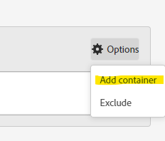

# De magie achter het gordijn: complexe segmenten: uitsluiten, containers en attributie

_ontdek de ingewikkeldheid van complexe gegevenssegmentatie, het onderzoeken sluit, containers, en attributiemodellen uit. Net als een handje van een goochelaar, stelt het beheersen van deze technieken analisten in staat om gegevensmagie uit te voeren, inzichten met precisie en vinding om te zetten._

De gordijnen zijn open, het podium is ingesteld... dit is misschien geen magische handeling van Las Vegas, maar we kunnen een aantal verbazingwekkende trucs uitvoeren bij het bouwen van onze segmenten.

Binnen deze module zullen wij behandelen:

- Logica uitsluiten
- Containers gebruiken
- Attributiemodel

## Inclusief of uitsluiten

Door gebrek, omvatten alle containers beginnen als **&#x200B;**&#x200B;type, fundamenteel betekenend dat zij de gegevens terugkeren die de criteria aanpassen. Nochtans, kunt u het segment, of de containers binnen de segmenten ook veranderen om **&#x200B;**&#x200B;type uit te sluiten, toestaand u om bepaalde criteria te verwerpen.

Hoewel een goochelaar je kaart in het dek kan vinden, is het verbazingwekkend wanneer die goochelaar de rest van het dek niet kan laten bestaan. Op dezelfde manier in sluit segmenten uit, willen wij de ongewenste gegevens eenvoudig van onze gegevensreeks verdwijnen.

Misschien zit je daar te denken: &quot;Oké, maar ik heb al opties &quot;Is niet gelijk&quot; en &quot;Bevat niet&quot;, dus moet dat me niet bedekken?&quot; Jammer genoeg, is het antwoord daarop neen... en het gaat niet alleen over het kunnen groepen van logica uitsluiten, over één enkel element. Zelfs wanneer het behandelen van één enkele component, zult u vaak *moeten gebruiken sluit* uit om uw doel te bereiken.

- **bevat niet/is niet gelijk** - is enkel wat het als klinkt, aanpassend op punten die geen specifiek koord bevatten
- **uitsluiten: De waarde bevat/evenaart** - dit ** punten zal uitsluiten die het koord aanpassen

Op eerste gezicht, klonen deze allebei het zelfde.. en op **raakten** niveausegmenten/containers, zou u correct zijn, aangezien zij de zelfde actie zullen uitvoeren. Nochtans, wanneer het gebruiken van **bezoek** of **bezoeker** werkingsgebied u zult zeer verschillende resultaten krijgen.

**Figuur 1: Bevat niet/is niet gelijk - het werkingsgebied van de Bedekking**

*Bericht dat elke slag een waar of valse waarde terugkeert, en dat die waarden tussen niet worden omgekeerd doet en sluit uit.*

- Bevat &quot;Waarde&quot; niet &quot;Voorbeeld&quot; (Ja), retourneert daarom true en neemt die hit op. Bevat &quot;Voorbeeld&quot; evenmin &quot;Voorbeeld&quot; (geen voorbeeld), retourneert daarom false en neemt die hit niet op. Retourneer in principe alle gegevens die een waar resultaat opleveren.
- Bevat &quot;Waarde&quot; &quot;Voorbeeld&quot; (nee), retourneert daarom false en sluit die hit niet uit. Bevat &quot;Voorbeeld&quot; ook &quot;Voorbeeld&quot; (yes), retourneert daarom true en sluit die hit uit. Basistatief, terugkeergegevens die **&#x200B;**&#x200B;geen waar resultaat hebben, of terugkeergegevens die vals aan uw criteria zijn.
- U kunt zien dat op het **1&rbrace; niveau van het Actief, beide reeksen logica de zelfde reeks gegevens zal terugkeren.**

**Figuur 2: Bevat niet/is niet gelijk - het werkingsgebied van het Bezoek**

*als hierboven, zal elke klap binnen het **bezoek**&#x200B;met zelfde waar/vals worden geëvalueerd. Nochtans, is de gegevensreeks die is teruggekeerd die van het volledige bezoek.*

- Op elke hit bevat &quot;Value&quot; geen &quot;Example&quot; (yes), dus retourneert &quot;Example&quot; geen &quot;Example&quot; (no, it contains it it), zodat false wordt geretourneerd.
   - Als **om het even welke** slag in het bezoek **waar** terugkeert, dan is het **volledige bezoek** teruggekeerd.*
   - Als het bezoek volledig uit klappen werd samengesteld die &quot;Voorbeeld&quot;toen bevatten zouden geen klappen waar terugkeren, en daarom zou dat bezoek **niet** in uw gegevensreeks zijn teruggekeerd.
- Op elke hit bevat &quot;Example&quot; (yes) dus &quot;true&quot;
   - Als **om het even welke slag** **waar** terugkeert, zal het volledige bezoek **uitgesloten** zijn
   - Als **alle hits** in de bezoekterugkeer **vals**, dan zal dat bezoek in uw gegevensreeks zijn teruggekeerd
- Nu kun je zien waar deze logica begint af te wijken. In het bovenstaande voorbeeld zijn er drie verschillende bezoeken:
   - Wanneer het gebruiken van &quot;bevat niet/Gelijk&quot;**twee van de drie** bezoeken zullen zijn teruggekeerd.
   - Wanneer het gebruiken van &quot;Uitsluiten bevat/evenaart&quot;**slechts één** van die bezoeken zal zijn teruggekeerd

**Figuur 3: Bevat niet/is niet gelijk - het werkingsgebied van het Bezoek**

*als hierboven, zal elk geraakt die door de **bezoeker**&#x200B;wordt gemaakt met de zelfde waar/valse logica worden geëvalueerd. Maar nu bekijken wij alle klappen die deze bezoeker, over alle bezoeken (binnen de geselecteerde datumwaaier) heeft gemaakt.*

- Op elke hit bevat &quot;Value&quot; geen &quot;Example&quot; (yes), dus retourneert &quot;Example&quot; geen &quot;Example&quot; (no, it contains it it), zodat false wordt geretourneerd.
   - Als **om het even welk** geraakt door de bezoeker wordt gemaakt waar **&#x200B;**&#x200B;terugkeert, dan is het **volledige bezoek** teruggekeerd.
   - Als de bezoeker nooit om het even welke aanzet maakte die &quot;Voorbeeld&quot;toen bevatte zouden geen aanslagen waar terugkeren, en daarom zou die bezoeker **niet** in uw gegevensreeks zijn teruggekeerd.
- Op elke hit bevat &quot;Example&quot; (yes) dus &quot;true&quot;.
   - Als **om het even welke aanraking** **waar** terugkeert, zal de volledige bezoeker (en nadien al hun bezoeken) **worden uitgesloten.**
   - Als **alle hits** in de bezoekterugkeer **vals**, dan zal die bezoeker in uw gegevensreeks zijn teruggekeerd, daardoor met succes terugkerende bezoekers die &quot;X&quot;niet deden.
- Dit is een uitbreiding van de logica van het bezoek, waar nog meer overwegingen zijn. In het bovenstaande voorbeeld zijn er twee verschillende bezoekers, met elk drie bezoeken:
   - Wanneer het gebruiken van &quot;bevat niet/Gelijk&quot;**zowel** bezoekers zullen zijn teruggekeerd, zoals alle **drie** van hun bezoeken (rekenend voor 2 bezoekers en 6 totale bezoeken in uw rapporten)
   - Wanneer het gebruiken van &quot;Uitsluiten bevat/evenaart&quot;**slechts één** van die bezoekers zal zijn teruggekeerd, en slechts zullen de drie bezoeken verbonden aan die bezoeker worden omvat (rekenend voor 1 bezoeker en 3 totale bezoeken in uw rapporten)

>[!TIP]
>
>Deze logica kan complex zijn, vooral wanneer u begint containers te nesten... het is altijd een goed idee om tegen gecontroleerde steekproefgegevens te testen om ervoor te zorgen dat uw segment in feite de gegevens terugkeert u denkt het zou moeten.

### Segmentvoorbeeld 1: bezoeken uitsluiten die een aankoop doen

In dit voorbeeld, wil ik gebruikers richten die aan een plaats kwamen, en *geen* een aankoop tijdens hun bezoek maakten (fundamenteel, wil ik de bezoeken uitsluiten die een transactie uitvoerden; daarom zal ik met de bezoeken worden verlaten die geen transactie voltooiden)

Ter vergelijking, kijk naar een segment dat wordt gebouwd gebruikend &quot;niet bestaat&quot;:

In de voorvertoning ziet u een heel ander resultaat... In feite retourneert dit segment 100% van mijn bezoeken, omdat elk bezoek ten minste één hit heeft die de &quot;Order&quot;-meting niet bevat.

Om dit verder te illustreren, laten wij de twee segmenten naast elkaar vergelijken:

Eerst, kunt u zien dat ondanks het *bezoek* niveauwerkingsgebied van het segment, wij het segment met andere metriek (zoals paginameningen of unieke bezoekers) kunnen paren. De eerste reeks kolommen is ongesegmenteerd, om in één oogopslag te laten zien dat het ene segment (niet bestaat) bijna 100% van de gegevens retourneert, doet alleen het exclude-segment wat we nodig hebben.

De meest opvallende kolom is de orden, die onmiddellijk duidelijk zouden moeten zijn dat de container &quot;niet bestaat&quot;verkeerd is, aangezien de meeste orden nog worden teruggegeven.

### Segmentvoorbeeld 2: bezoekers uitsluiten die een aankoop hebben gedaan binnen de rapportageperiode

In dit voorbeeld, wil ik de ideeën van de vorige steekproef gebruiken (die specifiek het bezoekniveau) keek en het uitbreiden om de bezoekers te vinden die geen aankoop binnen het tijdskader van mijn rapport hebben gemaakt.

Dit segment zal er ongeveer hetzelfde uitzien als het bovenstaande voorbeeld, bijna identiek, maar de reikwijdte van het segment zal een groot verschil maken.

Nu, als wij het bezoekersscoped segment met het bezoek hierboven scoped segment vergelijken, zult u zien dat veel meer gegevens, en veel meer bezoeken worden uitgesloten, aangezien *bezoekers die aankopen* maakten ook bezoeken hadden waar geen aankopen werden gemaakt, en zo, worden die bezoeken ook uitgesloten aangezien zij deel van de levenscyclus van de bezoeker uitmaken.

>[!IMPORTANT]
>
>Wanneer u een bezoeker scoped gegevens kijkt, langer uw rapporttijdkader, groter de uitsluiting zal zijn, aangezien vele bezoekers loyaal bezoekers aan uw plaats terugkeren (natuurlijk zullen sommige bedrijfsmodellen een hogere impact zien dan anderen)

>[!IMPORTANT]
>
>Terwijl de verschillen tussen bezoek en bezoeker *subtiel* (in het bijzonder in deze steekproefgegevens) kunnen zijn, zijn zij unieke logica die zou moeten worden overwogen. Afhankelijk van uw site en gebruikersgedrag kunnen uw gegevens opvallend verschillend zijn.

Het is belangrijk om precies te weten welke gegevens, of welk *verhaal*, u met uw rapport probeert te vertellen. Ervoor zorgen dat uw lijsten en visualisaties duidelijk het publiek ***vertellen wat*** wordt getoond, en het gebruiken van het aangewezen segmentmodel is kritiek aan het maken van aangewezen analyse. Een geïnformeerde beslissing kan alleen goed worden genomen als iedereen begrijpt waar hij naar kijkt.

## Containers gebruiken

Containers bieden ons de mogelijkheid om &quot;sub-logic&quot; te maken binnen de hoofdlogica van het segment, en een algemene misvatting is dat het bereik allemaal hetzelfde moet zijn tussen het segment en de container.. maar dat doet het niet. Dit geeft ons meer vrijheid om specifieke scenario&#39;s te creëren in het grotere geheel van dingen, om complexe logica te bouwen.

De beste manier om over containers na te denken is elke container een doos te zijn, en dat we dozen (van logica) binnen een andere doos, binnen een andere doos kunnen stapelen... maar in tegenstelling tot fysieke dozen waar elke doos kleiner moet zijn dan de buitendoos, kunnen we iets groter binnen zetten als dat ons ertoe aanzet om de juiste gegevens terug te krijgen. Beschouw het als een goochelhoed, waar het onmogelijke erin past en we de goochelaars van data zijn...

### Reikwijdte van de containers

Laten wij eerst een snelle onderbreking van *container* werkingsgebied doen. Als *het werkingsgebied van 0&rbrace; segment &lbrace;, hebt u uw basis **geraakt**,**bezoek**&#x200B;en **bezoeker**&#x200B;werkingsgebiedopties, maar soms zult u ook iets genoemd **logische groep**&#x200B;in plaats van bezoeker zien (dit zal slechts binnen opeenvolgende segmenten voorkomen, en wij zullen die in het volgende artikel behandelen).*

Het toevoegen van containers binnen uw segment (of binnen andere containers) kan worden bereikt door tot het toegang hebben van **opties** * menu (wanneer het nesten van veelvoudige punten, zorgvuldig zijn om aan het correcte blok toe te voegen - hoewel u gelukkig containers binnen de interface kunt slepen en laten vallen als u het aan de verkeerde plaats toevoegt)

**Figuur 1: Het toevoegen van een container**

Het werkingsgebied van een container is onafhankelijk van de ouder, zoals ik hierboven vermeld, moeten deze *niet* aanpassen, en afhankelijk van wat u wilt terugkeren, kunt u het plan moeten trekken om volledig visualiseren wat u nodig hebt, minstens tot u comfortabel het visualiseren in uw hoofd krijgt.

**Figuur 2: Het werkingsgebied van het segment vs containerwerkingsgebied**

>[!NOTE]
>
>De Adobe heeft logica om geldige en ongeldige segmenten te begrijpen, zouden zij u geen opties verstrekken die *nooit* werk... zodat als u de optie ziet om een bezoeker te gebruiken scoped container binnen een hit scoped segment, betekent dit het een geldige optie is.

Enkel als voor basissegmenten, wanneer u begint om een complex segment met genestelde containers te bouwen, moet u een duidelijk idee over ***hebben wat*** soort gegevens u wilt zijn teruggekeerd. ***hoe*** u van plan bent om die gegevens te gebruiken? ***Welke*** metriek bent u op het telegraferen met het segment van plan?

Deze vragen zullen helpen bepalen wat het werkingsgebied van het segment als geheel zal zijn, is dit het uitgangspunt aan om het even welk segment.

Enkel omdat u van plan bent om een segment met uw unieke bezoekers te koppelen, betekent niet dat het segment zelf bezoekersniveau... ver van het zou moeten zijn. Een segment van het bezoekersniveau zal alle gegevens voor een bezoeker terugkeren.. dit betekent al hun bezoeken, al hun paginameningen etc.. zodra een bezoeker uw segmentcriteria aanpast, kon uw segment beginnen om gegevens van *voorbij* voor deze bezoeker (zolang het binnen de datumwaaier van uw werkruimte is) terug te keren.

>[!IMPORTANT]
>
>Zelfs wanneer het van plan zijn om een segment met unieke metrische bezoekers te paren, betekent dit *niet* dat het segment bezoekersbereik automatisch zou moeten zijn... Deze misvatting *zou* tot opgeblazen en onjuiste resultaten kunnen leiden.

Ik heb veel gesproken over de concepten van hoe je het juiste bereik kunt selecteren, maar geen voorbeelden of details die je echt helpen... dus laten we daar nu in duiken met een paar voorbeelden van echte bruikbare gevallen. Ze zeggen dat een goochelaar nooit hun geheimen onthult, maar dat is niet helemaal waar. Binnen de magische wereld worden de technieken en &quot;achter het gordijn&quot;-werkingen vaak met gelijken gedeeld, zodat ze kunnen voortbouwen op de illusie en deze kunnen verbeteren... en dat is wat ik wil doen... om de deur open te zetten voor de mogelijkheden die je wachten.

### Segmentvoorbeeld 3: weergaven op specifieke pagina&#39;s van bezoekers die een recente bestelling hebben uitgevoerd (binnen de rapportageperiode)

In dit scenario, wil ik slechts een reeks specifieke pagina&#39;s terugkeren die door recente kopers werden geraakt (merk op dat ik dit met bezoeken of unieke bezoekers kan nog koppelen, alhoewel het segment zelf bij een werkingsgebied van HIT zal zijn).

Dit soort scenario is goed om te bekijken als ik kopers heb die specifieke pagina&#39;s op een plaats bekijken, pagina&#39;s die niet uitdrukkelijk met een specifieke gebeurtenis kunnen worden verbonden.

Mijn voorbeeld gaat de pagina&#39;s van &quot;Aanbevolen Overeenkomsten&quot;en &quot;Aanbevolen Producten bekijken&quot;. Momenteel, zullen wij de logica eenvoudig houden en niet in opeenvolgende segmentatie (minstens nog niet, maar wij zullen complexere logica als dat in een toekomstig artikel behandelen).

Een andere vraag is **waarom** wij terugtrekken door treffers? Technisch zou ik door Bezoekingen of Bezoekers hier kunnen trekken, maar ik kan deze specifieke pagina&#39;s door **paginameningen (voor de specifieke paginaset) per bezoek** of **paginameningen (voor de specifieke reeks) per bezoeker** ook willen bekijken, geeft dit werkingsgebied me de flexibiliteit om deze specifieke berekening uit te voeren. Aangezien deze treffers gemakkelijk met bezoeken of unieke bezoekers kunnen worden gecombineerd om het aantal bezoeken of bezoekers te bepalen die deze pagina&#39;s zien, zal ik voor het meest flexibele segment kiezen dat ik voor alle scenario&#39;s kan gebruiken.

Ten eerste, ter vergelijking, hier is een eenvoudig op HIT-Gebaseerd segment voor de specifieke pagina&#39;s.

Nu, bouwen in de ingewikkeldheid:

U zult merken dat ik niet alleen meerdere containers gebruik, maar dat ik het bereik van deze containers vermeng. Het segment als geheel bevindt zich op HIT-niveau, maar ik ben ook op zoek naar bezoekers die een bestelling hebben gedaan.

Laten we wat tijd besteden om dit uit te pakken, want er is veel gaande.

In de eerste plaats laat ik in plaats van een dagelijkse ineenstorting een paginascheiding zien, omdat ik denk dat dit de twee segmenten beter zal illustreren.

<table style="border: 0;">
    <tr>
        <td width="352" style="border: 0;">De eerste drie kolommen (Paginaweergaven, bezoeken en unieke bezoekers) zijn ongesegmenteerd en geven dus alle pagina's in de site weer. Ik heb hier geen bestellingen opgenomen, omdat bestellingen worden bijgehouden in een handeling en dus geen deel uitmaken van het bereik van de pagina-dimensie.</td>
        <td style="border: 0;">&lt;img src="assets/segment-example-3/segment3c-comparison-table-detail1.png" width="352"
        </td>
    </tr>
</table>

<table style="border: 0;">
    <tr>
        <td width="352" style="border: 0;">Daarna, toon ik het resultaat van het eenvoudige segment, kijkend slechts <strong> klappen </strong> op de twee gespecificeerde pagina's. U zult merken dat de andere pagina's in de uitsplitsing allemaal 0 opleveren, zoals u verwacht.</td>
        <td style="border: 0;">&lt;img src="assets/segment-example-3/segment3c-comparison-table-detail2.png" width="352"
        </td>
    </tr>
</table>

<table style="border: 0;">
    <tr>
        <td width="352" style="border: 0;">Hier is een klein bonusuiteinde, voordat ik het resultaat van het geavanceerde segment laat zien, gebruikte ik nog een eenvoudig segment van "Orders bestaan" (op HIT-niveau), en ik koppelde het aan unieke bezoekers. Dit zal me de totale UVs terugkeren die orden in mijn verslagperiode maakten, evenals UVs die elk van die pagina's raken.. dit zal helpen om de volgende reeks kolommen beter te illustreren.</td>
        <td style="border: 0;">&lt;img src="assets/segment-example-3/segment3c-comparison-table-detail3.png" width="352"
        </td>
    </tr>
</table>

<table style="border: 0;">
    <tr>
        <td width="352" style="border: 0;">De laatste reeks kolommen wordt gestapeld met mijn complexe segment. De algemene UV's met bestellingen komen overeen met het eenvoudige segment "Bestellingen bestaan" op elke pagina, maar u zult zien dat het totaal aanzienlijk verschilt. Aangezien deze gegevensset expliciet alleen beperkt is tot bezoekers die bestellingen hebben geplaatst EN de pagina's raken, ben ik expliciet geïnteresseerd in deze set.</td> <td style="border: 0;">
        </td>
    </tr>
</table>

### Segmentvoorbeeld 4: bezoeken die aanbevolen deals OF producten betreffen EN een bestelling maken tijdens hetzelfde bezoek

In het bovenstaande voorbeeld ziet u hoe u een container met een groter bereik (bezoeker) binnen een kleinere container met bereik kunt toevoegen (druk dus op zodat het geen verrassing is dat u raakcontainers binnen bezoekers kunt toevoegen of bereiksegmenten kunt bezoeken).

Op sommige van dezelfde pagina&#39;s waar we eerder naar keken, willen we nu gewoon de bezoekers terugkrijgen die de aanbevolen deals of de aanbevolen productpagina raakten EN die tijdens hetzelfde bezoek een bestelling maakten.

Dit segment mengt alle drie het werkingsgebied. Het hoogste niveau van het segment is bezoeker, zodat zal dit ervoor zorgen dat ALLE klappen van alle bezoeken voor de passende bezoeker worden teruggekeerd. Daarbinnen hebben wij een container toegevoegd van het bezoekbereik, dat zal ervoor zorgen dat de bezoeker minstens één bezoek moet hebben gehad dat aan de specifieke criteria van het maken van een orde voldoet EN specifieke pagina&#39;s heeft bezocht. We hebben een container van het bereik van hit toegevoegd voor de pagina&#39;s zelf, zodat we OR-logica kunnen gebruiken om te zoeken naar de pagina met aanbevolen deals OF de pagina met aanbevolen producten.

Het voordeel aan dit bezoeker scoped segment is dat dit **ALLE** bezoeken van de bezoekers zal terugkeren die deze criteria aanpassen, zodat zal dit segment goed zijn als ik het gedrag in vorige bezoeken wilt zien die tot deze combinatie leiden, en de acties van deze bezoekers na zulk een scenario.

Hier vergelijkt ik hits op aanbevolen deals/aanbevolen inhoud met bestellingen die al bestaan, met het complexe segment waarin zowel de bestelling als een van de opgegeven pagina&#39;s zich tijdens hetzelfde bezoek bevinden. Het complexe segment is waar de twee eerste segmenten elkaar kruisen; maar aangezien het bezoekerswerkingsgebied is, zullen alle andere bezoeken voor die bezoekers eveneens worden teruggekeerd.

## Attributiemodel

Attributiemodellen binnen een segmentdefinitie hebben meestal betrekking op dimensies die een niet-klapbare vervaldatum hebben, dus props (die altijd raakniveau zijn) zijn niet echt een goede kandidaat. Uw eVars, marketingkanalen, enz. maar zijn eigenlijk waar deze instellingen voor bedoeld zijn .

Voordat we naar het segment kijken, moeten we snel bekijken hoe attributiemodellering in een eenvoudig voorbeeld werkt.

Laten we zeggen dat we twee eVars hebben, waarvan er één op het punt staat te vertrekken (eVar1), en één op 30 dagen vervalt (eVar2). Om het eenvoudig te houden, gaan we een interne campagne (icid) volgen.

**Bezoek 1**

- Pagina A
   - **eVar1** wordt niet geplaatst
   - **eVar2** wordt niet geplaatst
- Klik op Promo Banner met ?icid=promo-banner in de URL
- Pagina B
   - **eVar1** en **eVar2** worden geplaatst aan &quot;promo-banner&quot;
   - **Instantie van eVar1** wordt teweeggebracht
   - **Instantie van eVar2** wordt teweeggebracht
- Pagina C
   - Zowel **eVar1** als **eVar2** handhaven de waarde &quot;promo-banner&quot;
   - Geen van de maatgegevens van de instantie voor de eVars wordt geactiveerd, omdat beide Vars persistente waarden gebruiken

**Bezoek 2**

- Pagina D
   - **eVar1** wordt niet geplaatst aan om het even welke waarde, en geen **Instantie van eVar1** wordt teweeggebracht
   - **eVar2** handhaaft de waarde &quot;promo-banner&quot;toe te schrijven aan de vervaldatum van 30 dagen
   - **Instantie van eVar2** wordt niet teweeggebracht, omdat de waarde blijvend en niet eigenlijk plaats is
- Klik op Aanbieding zijspoor met ?icid=promo-side-rail in de URL
- Pagina E
   - **eVar1** en **eVar2** worden geplaatst aan &quot;promo-side-rail&quot;
   - **Instantie van eVar1** wordt teweeggebracht
   - **Instantie van eVar2** wordt teweeggebracht
- Pagina F
   - Zowel **eVar1** als **eVar2** handhaven de waarde &quot;promo-side-rail&quot;
   - Geen van de maatgegevens van de instantie voor de eVars wordt geactiveerd, omdat beide Vars persistente waarden gebruiken

Momenteel is het verwachte resultaat van deze twee bezoeken:

<table><tr><th colspan="1" valign="top"></th><th colspan="1" valign="top"></th><th colspan="1" valign="top"><b>Paginaweergaven</b></th><th colspan="1" valign="top"><b>Bezoeken</b></th><th colspan="1" valign="top"><b>Instance van eVar1</b></th><th colspan="1" valign="top"><b>Instance van eVar2</b></th></tr>
<tr><td colspan="1" valign="top"></td><td colspan="1" valign="top"></td><td colspan="1" valign="top">6</td><td colspan="1" valign="top">2</td><td colspan="1" valign="top">2</td><td colspan="1" valign="top">2</td></tr>
<tr><td colspan="1" rowspan="7" valign="top">Pagina</td><td colspan="1" valign="top"></td><td colspan="1" valign="top">6</td><td colspan="1" valign="top">2</td><td colspan="1" valign="top">2</td><td colspan="1" valign="top">2</td></tr>
<tr><td colspan="1" valign="top">Pagina A</td><td colspan="1" valign="top">1</td><td colspan="1" valign="top">1</td><td colspan="1" valign="top">0</td><td colspan="1" valign="top">0</td></tr>
<tr><td colspan="1" valign="top">Pagina B</td><td colspan="1" valign="top">1</td><td colspan="1" valign="top">1</td><td colspan="1" valign="top">1</td><td colspan="1" valign="top">1</td></tr>
<tr><td colspan="1" valign="top">Pagina C</td><td colspan="1" valign="top">1</td><td colspan="1" valign="top">1</td><td colspan="1" valign="top">0</td><td colspan="1" valign="top">0</td></tr>
<tr><td colspan="1" valign="top">Pagina D</td><td colspan="1" valign="top">1</td><td colspan="1" valign="top">1</td><td colspan="1" valign="top">0</td><td colspan="1" valign="top">0</td></tr>
<tr><td colspan="1" valign="top">Pagina E</td><td colspan="1" valign="top">1</td><td colspan="1" valign="top">1</td><td colspan="1" valign="top">1</td><td colspan="1" valign="top">1</td></tr>
<tr><td colspan="1" valign="top">Pagina F</td><td colspan="1" valign="top">1</td><td colspan="1" valign="top">1</td><td colspan="1" valign="top">0</td><td colspan="1" valign="top">0</td></tr>
</table>

<table><tr><th colspan="1" valign="top"></th><th colspan="1" valign="top"></th><th colspan="1" valign="top"><b>Paginaweergaven</b></th><th colspan="1" valign="top"><b>Bezoeken</b></th><th colspan="1" valign="top"><b>Instance van eVar1</b></th></tr>
<tr><td colspan="1" valign="top"></td><td colspan="1" valign="top"></td><td colspan="1" valign="top">4</td><td colspan="1" valign="top">2</td><td colspan="1" valign="top">2</td></tr>
<tr><td colspan="1" rowspan="3" valign="top">eVar1</td><td colspan="1" valign="top"></td><td colspan="1" valign="top">4</td><td colspan="1" valign="top">2</td><td colspan="1" valign="top">2</td></tr>
<tr><td colspan="1" valign="top">promo banner</td><td colspan="1" valign="top">2</td><td colspan="1" valign="top">1</td><td colspan="1" valign="top">1</td></tr>
<tr><td colspan="1" valign="top">promo-side-rail</td><td colspan="1" valign="top">2</td><td colspan="1" valign="top">1</td><td colspan="1" valign="top">1</td></tr>
</table>

<table><tr><th colspan="1" valign="top"></th><th colspan="1" valign="top"></th><th colspan="1" valign="top"><b>Paginaweergaven</b></th><th colspan="1" valign="top"><b>Bezoeken</b></th><th colspan="1" valign="top"><b>Instance van eVar2</b></th></tr>
<tr><td colspan="1" valign="top"></td><td colspan="1" valign="top"></td><td colspan="1" valign="top">5</td><td colspan="1" valign="top">2</td><td colspan="1" valign="top">2</td></tr>
<tr><td colspan="1" rowspan="3" valign="top">eVar2</td><td colspan="1" valign="top"></td><td colspan="1" valign="top">5</td><td colspan="1" valign="top">2</td><td colspan="1" valign="top">2</td></tr>
<tr><td colspan="1" valign="top">promo banner</td><td colspan="1" valign="top">3</td><td colspan="1" valign="top">2</td><td colspan="1" valign="top">1</td></tr>
<tr><td colspan="1" valign="top">promo-side-rail</td><td colspan="1" valign="top">2</td><td colspan="1" valign="top">1</td><td colspan="1" valign="top">1</td></tr>
</table>

Nu, kijk waar u attributie in uw segment kunt plaatsen.

**Figuur 4: Het model van de Attributie**

*het tandwielpictogram op uw afmeting is waar u attributie kunt plaatsen. Elke optie heeft informatie beschikbaar wanneer het hangen over &quot;?&quot; pictogram. Basilicum:*

- Het standaardgedrag retourneert alle instanties van de eVar waar de waarde is ingesteld (specifiek of via de ingestelde toewijzing)
- Instance retourneert alleen de dimensie waar de waarde expliciet is ingesteld (d.w.z. bij de treffers waar de &quot;Instance of eVar&quot; wordt geactiveerd)
- De niet-herhalende instantie retourneert alleen de eerste keer dat de waarde van de dimensie is ingesteld (dat wil zeggen, hoewel deze niet in het bovenstaande voorbeeld is opgenomen, stelt u zich voor dat de gebruiker meerdere keren op de promo-banner heeft geklikt, zodat de instantie van eVar elke keer dat op de banner wordt geklikt, wordt met deze instelling alleen de eerste unieke instantie van &quot;promo-banner&quot; gebruikt en alle volgende tellingen van deze banner worden genegeerd)

### Segmentvoorbeeld 5: Marketingkanaal &quot;Betaalde zoekopdracht&quot; versus de directe zoekacties

Zoals we allemaal moeten weten, hebben marketingkanalen een lange attributiemodel (standaard 30 dagen, maar deze kunnen worden aangepast aan uw eigen behoeften). Als deze optie eenmaal is ingesteld, wordt het marketingkanaal niet overschreven door volgende &quot;directe&quot; bezoeken aan de site, zodat de specifieke stuurprogramma&#39;s de conversie-toewijzing krijgen. Nochtans, soms moet u specifiek de ***ingangen*** in uw plaats door een specifiek marketing kanaal zien; en door ingangen, bedoel ik u moet zien wanneer het marketing kanaal specifiek wordt geplaatst gebaseerd op uw marketing verwerkingsregels.

Laten we dingen veranderen en beginnen door naar de vergelijkingen te kijken, dan graven we in de segmenten.

<table style="border: 0;">
    <tr>
        <td width="352" style="border: 0;">De eerste vier kolommen zijn ongesegmenteerd en moeten gemakkelijk te begrijpen zijn. *"Berichten"* is in feite een berekende waarde die is gebaseerd op waar bezoekers de sessie starten. Ik heb het hier toegevoegd om aan te tonen dat dit niet de informatie terugkeert die wij zoeken, aangezien de gebruikers de plaats door veelvoudige marketing kanalen (door sociale media te bekijken, onderzoeken te doen, op marketing e-mails, enz. kunnen ingaan. alle tijdens hetzelfde bezoek / dezelfde sessie).</td> <td style="border: 0;">
        </td>
    </tr>
</table>

<table style="border: 0;">
    <tr>
        <td width="352" style="border: 0;">De volgende reeks kolommen gebruikt een "StandaardSegment van het Actief", fundamenteel kijkend klusjes waar het marketing kanaal "betaalde onderzoek"is. Nochtans, zal dit ALLE klusjes terugkeren die op de attributie van het Kanaal van de Marketing worden gebaseerd, zal het niet de daadwerkelijke "Betaalde Onderzoek"klikthrough isoleren. Daarom zal dit niet de gegevens terugkeren die we nodig hebben.</td> <td style="border: 0;">
        </td>
    </tr>
</table>

<table style="border: 0;">
    <tr>
        <td width="352" style="border: 0;">De volgende twee gegevenssets zien er nu precies hetzelfde uit. In feite retourneert dit dezelfde gegevens op twee verschillende manieren. Maar nu bekijk ik specifiek de <i> instanties </i> waar het marketing kanaal <strong> </strong> aan "Betaald Onderzoek"werd geplaatst.</td> <td style="border: 0;">
        </td>
    </tr>
</table>

Dit kan op twee manieren gebeuren:

Eerst, gebruikt dit de &quot;standaard&quot;afmetingsattributie, en het verpakken van dit met de specifieke metrische &quot;Instantie van het Kanaal van de Marketing&quot; (aangezien a ** logica) bestaat:

Ten tweede kunt u voor een eenvoudiger segment de toewijzing wijzigen in Instantie. De naam van de dimensie verandert van &quot;Marketing Channel&quot; in &quot;Marketing Channel (Instance)&quot;.

## Alles samenvoegen

Zoals elke goede goochelaar, kunnen we beginnen met elke individuele truc, het publiek opbouwen terwijl we gaan, en ze leiden naar het definitieve &quot;prestige&quot;. Dit is waar we echt schijnen, door alle kleine trucs te nemen, en ze in een groots finale te rollen. De schijnbaar losgekoppelde delen van de truc nemen en laten zien dat ze in feite allemaal samenwerken om een samenhangend geheel te vormen.

### Segment voorbeeld 6: Bezoekers die tijdens een bezoek met een betaald sociaal exemplaar een bestelling hebben gedaan, met uitzondering van bezoekers die zich hebben ingeschreven voor nieuwsbrieven

Op die manier kan ik bezoekers identificeren die actief een aankoop hebben gedaan tijdens een bezoek van een sociale mediacampagne, maar zich niet hebben aangemeld voor onze nieuwsbrieven. Hierdoor kan ons marketingteam de potentiële groep gebruikers zien die voor nieuwsbrieven en marketing e-mails probeert om te zetten.

## Finale

Er zijn zo veel manieren om de logica te combineren om in zeer gedetailleerde scenario&#39;s te geraken, dat ik alleen maar het oppervlak van de mogelijkheden kan krabben.

Net als iedere andere grote goochelaar is de echte kracht in het inspireren van de opkomende generatie om voort te bouwen op de basisbeginselen, om de lessen te herdenken in iets nieuws en wonderbaars! Ik kijk ernaar uit om te zien wat jullie allemaal verzinnen!

## Auteur

Dit document is geschreven door:

Jennifer Dungan, Optimization Manager Analytics at Torstar

Adobe Analytics Champion

